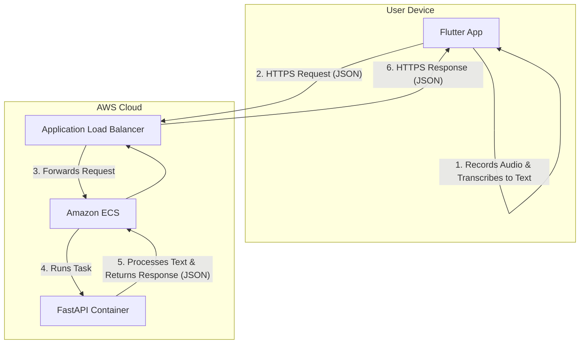

# 02. System Architecture

This document outlines the high-level architecture of the Precackle project, detailing the components and the flow of data between them.

## 2.1. Component Diagram

The system is composed of three primary components: the Flutter Frontend, the FastAPI Backend, and the AWS Infrastructure that hosts the backend.

## 2.2. Data Flow

The end-to-end data flow for a single user interaction is as follows:

1.  **Client-Side Transcription:** The user interacts with the **Flutter App**. The app uses the device's hardware and the `speech_to_text` package to record audio and convert it to a text string. This all happens locally on the user's device.

2.  **API Request:** The Flutter app constructs a JSON payload containing the transcribed text. It sends this payload as an HTTPS POST request to the backend API, whose address is exposed by the **Application Load Balancer (ALB)**.
    -   *Example Payload:* `{ "messages": [{ "role": "user", "content": "hello world" }] }`

3.  **Request Routing:** The **ALB** receives the request and forwards it to a target group configured for the **Amazon ECS** service.

4.  **Backend Processing:** **ECS** runs the containerized **FastAPI Application**. FastAPI receives the request, validates the JSON payload against its Pydantic models, and executes the endpoint logic.
    -   *Initial Phase:* The backend calculates the word count of the input text.
    -   *Future Phase:* The backend will forward the request to an external LLM provider.

5.  **API Response:** The FastAPI application generates a response and returns it as a JSON object.
    -   *Example Response:* `{ "message": { "role": "assistant", "content": "The word count is 2." } }`

6.  **Displaying the Result:** The **Flutter App** receives the HTTPS response, parses the JSON, and displays the content of the assistant's message in the UI.

## 2.3. API Contract

The single source of truth for the API's structure is the `api/openapi.yaml` file. Both the frontend and backend MUST adhere to this contract.

-   The **Frontend** uses it to generate a type-safe Dart client.
-   The **Backend** (FastAPI) uses it for request validation and response serialization.

This contract-first approach ensures that the client and server remain synchronized.
