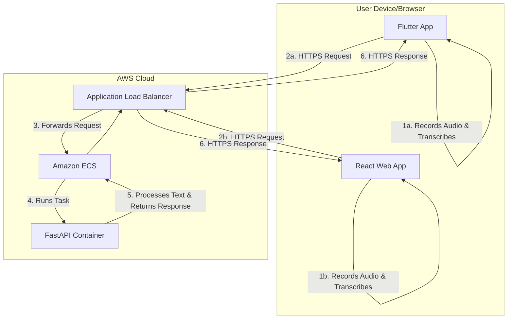

# 02. System Architecture

This document outlines the high-level architecture of the Cackle project, detailing the components and the flow of data between them.

## 2.1. Component Diagram

The system is composed of multiple frontend clients, a unified backend, and the AWS Infrastructure that hosts the backend.

## 2.2. Data Flow

The end-to-end data flow is identical for both mobile and web clients:

1.  **Client-Side Transcription:** The user interacts with a client application (either the **Flutter App** or the **React Web App**). The app uses the platform's native speech recognition capabilities to record audio and convert it to a text string locally.

2.  **API Request:** The client app constructs a JSON payload containing the transcribed text and sends it as an HTTPS POST request to the backend API, exposed by the **Application Load Balancer (ALB)**.
    -   *Example Payload:* `{ "messages": [{ "role": "user", "content": "hello world" }] }`

3.  **Request Routing:** The **ALB** receives the request and forwards it to the **Amazon ECS** service.

4.  **Backend Processing:** **ECS** runs the containerized **FastAPI Application**. FastAPI validates the request and executes the endpoint logic.
    -   *Initial Phase:* The backend calculates the word count of the input text.
    -   *Future Phase:* The backend will call an external LLM provider.

5.  **API Response:** The FastAPI application generates a response and returns it as a JSON object.
    -   *Example Response:* `{ "message": { "role": "assistant", "content": "The word count is 2." } }`

6.  **Displaying the Result:** The client application receives the HTTPS response, parses the JSON, and displays the assistant's message in the UI.

## 2.3. API Contract

The single source of truth for the API's structure is the `api/openapi.yaml` file. The backend and **all frontends** MUST adhere to this contract.

-   The **Frontends** use it to generate type-safe client libraries (Dart for mobile, TypeScript for web).
-   The **Backend** (FastAPI) uses it for request validation and response serialization.

This contract-first approach ensures that all clients and the server remain synchronized.
